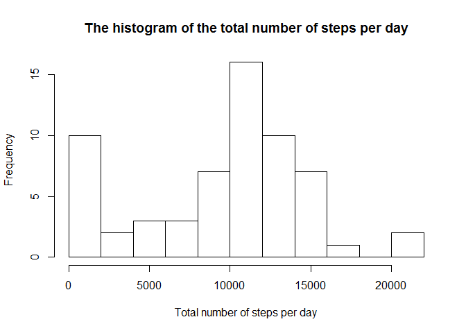
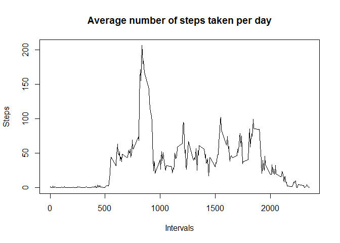
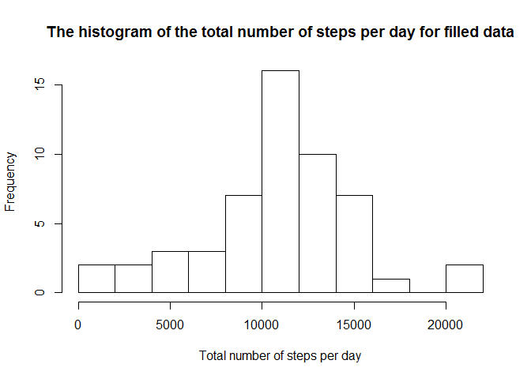
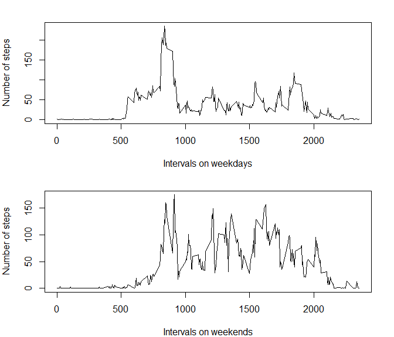

# Reproducible Research: Peer Assessment 1

## Loading and preprocessing the data


```r
library(dplyr)
```

```
## 
## Attaching package: 'dplyr'
## 
## The following objects are masked from 'package:stats':
## 
##     filter, lag
## 
## The following objects are masked from 'package:base':
## 
##     intersect, setdiff, setequal, union
```

```r
# Setting US locale for windows OS
Sys.setlocale("LC_TIME", "English")
```

```
## [1] "English_United States.1252"
```

```r
# unzipping the file and reading the data
data <- read.csv(unz("activity.zip", "activity.csv"), header = TRUE)
```
## What is mean total number of steps taken per day?

###1. The total number of steps taken per day


```r
#grouping by date and summing up the steps per day
by_date = 
summary_per_day <- data %>% 
    group_by(date) %>% 
    summarise(the_sum = sum(steps, na.rm = TRUE))
```

###2. The histogram of the total number of steps taken each day


```r
hist(summary_per_day$the_sum, breaks = 10, 
     xlab = "Total number of steps per day", main = "The histogram of the total number of steps per day")
```

 

###3. The mean and median of the total number of steps taken per day


```r
mean_per_day <- round(mean(summary_per_day$the_sum, na.rm = TRUE), 2)
median_per_day <-median(summary_per_day$the_sum, na.rm = TRUE)
```
Mean: 9354.23.

Median: 10395.

## What is the average daily activity pattern?
###1. The time series plot of the 5-minute interval (x-axis) and the average number of steps taken, averaged across all days (y-axis)

```r
by_interval = group_by(data, interval)
interval_means = by_interval %>% summarise(the_mean = round(mean(steps, na.rm = TRUE), 2))
plot(interval_means$interval, interval_means$the_mean, type = "l", 
     main = "Average number of steps taken per day", xlab = "Intervals", ylab = "Steps")
```

 

###2. The 5-minute interval, that contains the maximum number of steps on average across all the days in the dataset.

```r
max_avg_interval <- filter(interval_means, the_mean == max(the_mean))
interval_start <- max_avg_interval$interval
interval_end <- interval_start + 5

# modulus operator
hours_from = interval_start %/% 60

#integer division
minutes_from = sprintf("%02d", interval_start %% 60)

hours_to = interval_end %/% 60
minutes_to = sprintf("%02d", interval_end %% 60)
```
The result is 835 (from 13:55 to 14:00)
with the average steps number of 206.17.

## Imputing missing values
###1. The total number of rows with NAs

```r
nrow(data) - sum(complete.cases(data))
```

```
## [1] 2304
```

###2. The strategy for filling in all of the missing values in the dataset.
The strategy for filling missing values is to use the average number (mean) of steps per interval

###3. Create a new dataset that is equal to the original dataset but with the missing data filled in.

```r
mean_steps_per_interval <- mean(interval_means$steps)
```

```
## Warning in mean.default(interval_means$steps): argument is not numeric or
## logical: returning NA
```

```r
filled_data <- mutate(data, steps = ifelse(is.na(steps), mean_steps_per_interval, steps))
```
###4.(a) The histogram of the total number of steps taken each day and calculate and report the mean and median total number of steps taken per day. Do these values differ from the estimates from the first part of the assignment? What is the impact of imputing missing data on the estimates of the total daily number of steps?


```r
filled_summary = filled_data %>% 
    group_by(date) %>% 
    summarise(the_sum = sum(steps))

hist(filled_summary$the_sum, breaks = 10,
     main = "The histogram of the total number of steps per day for filled data", xlab = "Total number of steps per day")
```

 

###4.(b) The mean and median total number of steps taken per day.

```r
filled_mean <- round(mean(filled_summary$the_sum), 2)
filled_median <- median(filled_summary$the_sum)
```

Mean of the filled data: NA.

Median of the filled data: NA.

###4.(c) The impact of imputing missing data on the estimates of the total daily number of steps.
The hystogram without imputed values was very scewed at 0 values.

The impact of imputing missing values is a much less scewed hystogram.

## Are there differences in activity patterns between weekdays and weekends?
###1. Create a new factor variable in the dataset with two levels: “weekday<U+FFFD> and “weekend<U+FFFD>.

```r
weekday_name <- c('Monday', 'Tuesday', 'Wednesday', 'Thursday', 'Friday')

with_weekdays <- filled_data %>% mutate(
    weekday_type = ifelse(weekdays(as.Date(date)) %in% weekday_name, 'weekday', 'weekend'))
```


###2. The panel plot containing a time series plot of the 5-minute interval (x-axis) and the average number of steps taken, averaged across all weekday days or weekend days (y-axis).


```r
#function to create a plot for weekday type
plot_weekday_activity <- function(type) {
    by_interval = group_by(with_weekdays, interval)
    interval_means = by_interval %>% 
        filter(weekday_type == type) %>%
        summarise(the_mean = round(mean(steps, na.rm = TRUE), 2))
    
    plot(interval_means$interval, interval_means$the_mean, type = "l", 
         xlab = paste("Intervals on ", type, "s", sep = ""), ylab = "Number of steps")
}

#plot panel with two rows and one column
par(mfrow=c(2,1), mar=c(4, 4, 2, 2))

plot_weekday_activity('weekday')
plot_weekday_activity('weekend')
```

 

There are much more activities on weekends than on weekdays.
